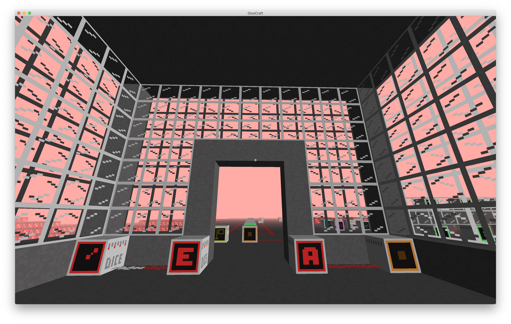
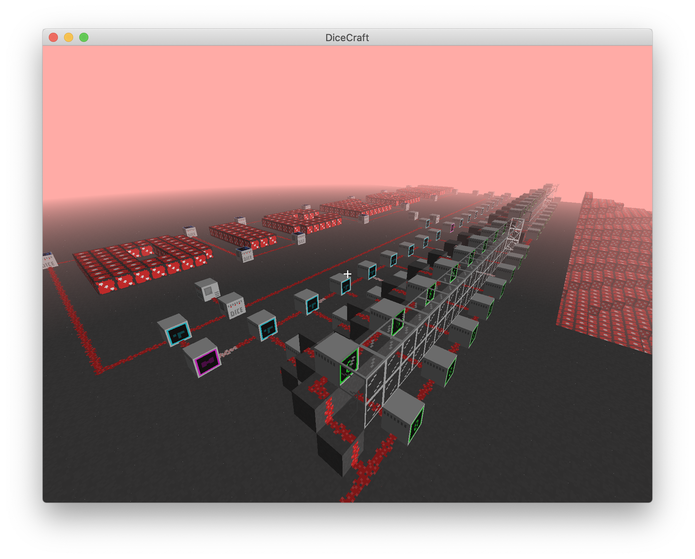

# DICECRAFT

A minecraft-like reverse engineering challenge for DiceCTF 2022.






# Building

Make sure to include submodules:
```
git clone --recurse-submodules https://github.com/hgarrereyn/dicecraft.git
```

```
mkdir build
cd build
cmake ../
make
```

Note: shaders and tileset are embedded into the source. Run `python3 embed_tilemap.py` to regenerate `./src/emb_tilemap.h` after modifying `./res/tilemap.png`

# Running:
```
./dicecraft <save.dat>
```

Challenge world is: `./release/chal.dat`

Controls:

- WASD: move
- left shift / right mouse: interact
- F: toggle fly
- space: fly up / jump
- N: fly down
- 0123456789rtyuio: place block
- P: save game (if launched with a save file)

See `./release` for prebuilt binaries.
